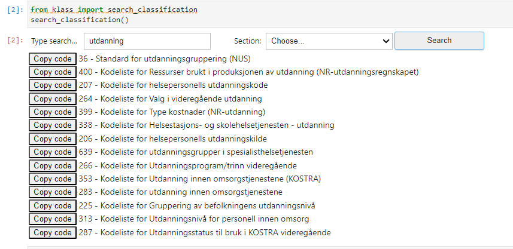

# ssb-klass-python / KLASS
[][pypi status]
[][pypi status]
[][pypi status]
[][license]

[][documentation]
[][tests]
[][sonarcov]
[][sonarquality]

[][pre-commit]
[][black]
[](https://github.com/astral-sh/ruff)
[][poetry]

[pypi status]: https://pypi.org/project/ssb-klass-python/
[documentation]: https://statisticsnorway.github.io/ssb-klass-python
[tests]: https://github.com/statisticsnorway/ssb-klass-python/actions?workflow=Tests

[sonarcov]: https://sonarcloud.io/summary/overall?id=statisticsnorway_ssb-klass-python
[sonarquality]: https://sonarcloud.io/summary/overall?id=statisticsnorway_ssb-klass-python
[pre-commit]: https://github.com/pre-commit/pre-commit
[black]: https://github.com/psf/black
[poetry]: https://python-poetry.org/
A Python package built on top of Statistics Norway's code- and classification-system "KLASS". \
The package aims to make Klass's API for retrieving data easier to use by re-representing Klass's internal hierarchy as python-classes. Containing methods for easier traversal down, search classes and widgets, reasonable defaults to parameters etc.
Where data is possible to fit into pandas DataFrames, this will be preferred, but hiererachical data / objects containing metadata will be kept as json / dict structure.


## Installing
The package is available on Pypi, and can be installed by for example poetry like this:
```bash
poetry add ssb-klass-python
```


## Example usages


### Getting started
```python
from klass import search_classification
# Opens a ipywidget in notebooks for searching for classifications and copying code, to get started
search_classification(no_dupes=True)
```



### Getting a classification directly
```python
from klass import get_classification # Import the utility-function
nus = get_classification(36)
```

```python
# Does the same as the code above, but does not shy away from using the class directly
from klass import KlassClassification # Import the class for KlassClassifications
nus = KlassClassification(36)  # Use ID for classification
```

When you have the classification stored in an object, you can "dig into" the API from there.
```python
codes = nus.get_codes() # codes from current date
print(codes)
codes.data  # Pandas dataframe available under the .data attribute
```


From searching through "families", down to a specific codelist
```python
from klass import KlassSearchFamilies
search = KlassSearchFamilies(360)
print(search)
>>> "Family ID: 20 - Utdanning - Number of classifications: 5"
utdanning = search.get_family(20)
print(utdanning)
>>> "The Klass Family "Utdanning" has id 20."
>>> "And contains the following classifications:"
>>>  "36: Standard for utdanningsgruppering (NUS)"
nus = utdanning.get_classification(36)
print(nus)
>>> "Classification 36: Standard for utdanningsgruppering (NUS)..."
nus_codes = nus.get_codes("2023-01-01")
print(nus_codes)
>>> "Codelist for classification: 36"
>>> " From date: 2023-01-01"
nus_codes.data  # A pandas dataframe
```


For more examples check out the demo-notebooks in the demo/ folder in the repo.


## Technical notes
Documentation for the [endpoints we are using can be found on Statistics Norways pages.](https://data.ssb.no/api/klass/v1/api-guide.html)

Technical architecture of the API we are interacting with is detailed in [Statistics Norway's **internal** wiki](https://wiki.ssb.no/display/KP/Teknisk+arkitektur#Tekniskarkitektur-GSIM).

This project has been migrated to follow the [SSB PyPI Template] from [Statistics Norway].

[statistics norway]: https://www.ssb.no/en
[pypi]: https://pypi.org/
[ssb pypi template]: https://github.com/statisticsnorway/ssb-pypitemplate
[file an issue]: https://github.com/statisticsnorway/ssb-klass-python/issues
[pip]: https://pip.pypa.io/

<!-- github-only -->

[license]: https://github.com/statisticsnorway/ssb-klass-python/blob/main/LICENSE
[contributor guide]: https://github.com/statisticsnorway/ssb-klass-python/blob/main/CONTRIBUTING.md
[reference guide]: https://statisticsnorway.github.io/ssb-klass-python/reference.html
